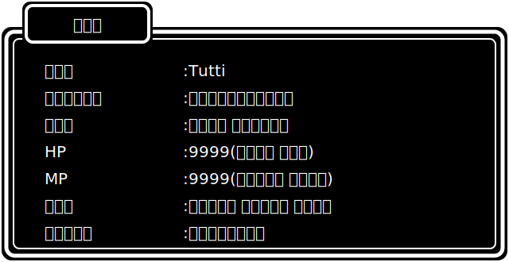
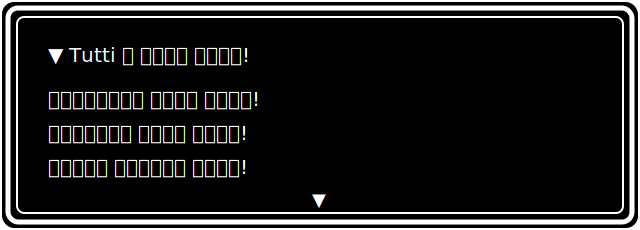
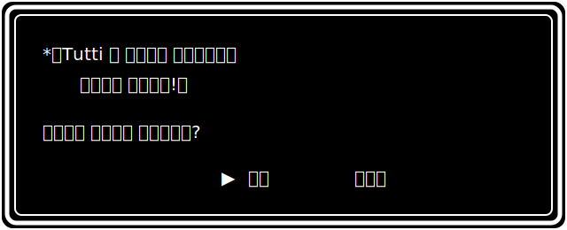

  

  

| コマンド |
|:---:|
| ▶ [そうびを みる](#equip) |
| [じゅもんを みる](#skills) |
| [ぼうけんのしょを みる](#stats) |
| [はなす](#talk) |

---

## ▼ そうび

| ぶい | そうびひん |
|:---:|:---|
| みぎて | TypeScript のつるぎ |
| ひだりて | React のたて |
| あたま | Next.js のかぶと |
| からだ | Node.js のよろい |
| くつ | Docker のブーツ |
| どうぐ | Python のふしぎな つえ |

---

## ▼ じゅもん

**― こうげきじゅもん(Frontend)―**

**― かいふくじゅもん(Backend)―**

**― ほじょじゅもん(Infra / Tools)―**

---

## ▼ ぼうけんのしょ

  

---

## ▼ はなす

  

 

**▶ [はい(Follow する)](https://github.com/TuttIIIIIIIIIII)   いいえ(このコマンドは えらべない)**

<!-- れんらくさき:X や Zenn、メールアドレスなどを追加する場合はここに -->

  

*ーーー そして ぼうけんは つづく ーーー*

